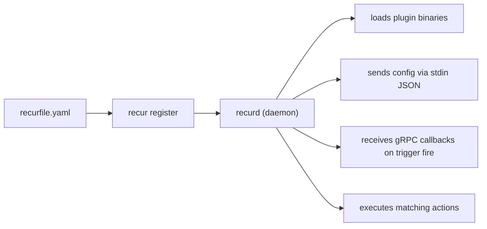
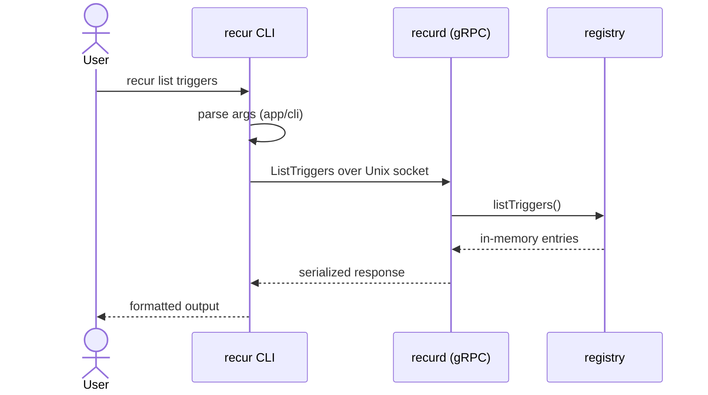
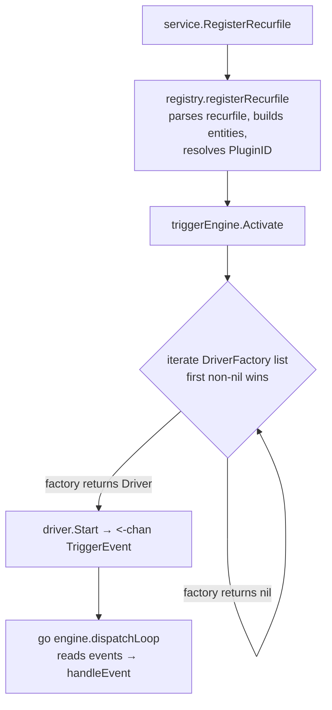
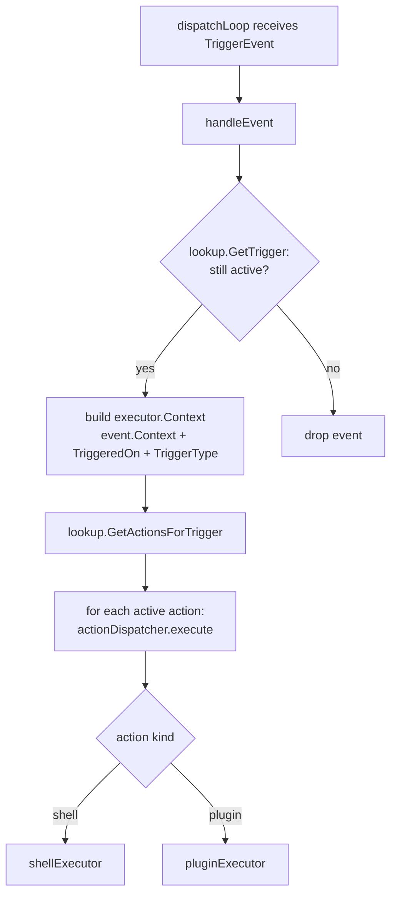
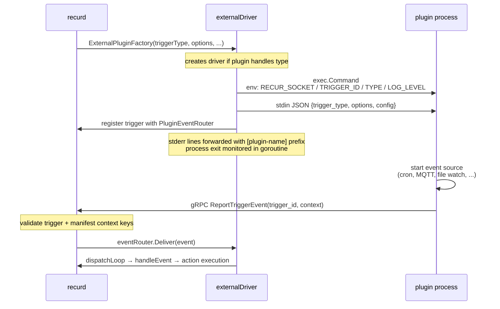

## Overview

Recur is composed of four main components that work together:

1. **Daemon** (`recurd`) — Runs in the background, managing the plugin lifecycle and trigger/action registry.
2. **Configuration files** — YAML recurfiles that declare what triggers to listen for and what actions to take.
3. **Plugins** — Standalone binaries that implement triggers and actions via an exec-based contract (stdin JSON for config, gRPC callback for events).
4. **CLI** (`recur`) — Communicates with the daemon via a Unix socket, with graceful fallback to file reads when the daemon is not running.



## Package Structure

```
src/
  app/                            # orchestration: each binary lives here
    recur/                        # the recur CLI binary
      main.go                     # package main
      cli/                        # package cli — Cobra commands
      text/                       # CLI-local Levenshtein helper
    recurd/                       # the recurd daemon binary
      main.go                     # package main
      daemon/                     # package daemon — lifecycle, registry, gRPC handlers
      triggerengine/              # package triggerengine — event engine + drivers
  domain/                         # abstractions: stdlib + pkg/* only, no I/O
    action/                       # Action entity
    config/                       # Config struct + key schema
    group/                        # Group entity
    plugin/                       # Plugin entity + UnknownTypes, TriggerDefaultsFor
    recurfile/                    # Recurfile entity + Raw* shapes + resolve/validate/
                                  # merge/builder (precedence chain, EntityID)
    secret/                       # SecretDef + Resolver interface
    trigger/                      # Trigger entity
  infra/                          # I/O implementations, named <subdomain><impl>
    yaml/                         # YAML-based
      recurfile/                  # package recurfileyaml
      manifest/                   # package manifestyaml
      config/                     # package configyaml
    jsonfile/state/               # package statejsonfile
    grpc/
      server/                     # package servergrpc (recurd-side ACL)
      client/                     # package clientgrpc (recur + plugin-side ACL)
      v1/                         # proto-generated
    subprocess/executor/          # package executorsubprocess
    os/
      process/                    # package processos — PID file, signals
      defaults/                   # package defaultsos — platform config defaults
    terminal/display/             # package displayterminal
    secret/{env,file,keyring,composite}/   # per-source resolvers + dispatcher
    fs/
      plugin/                     # package pluginfs — discovery, install, archive
      atomicfile/                 # crash-safe write helper
test/e2e/                         # end-to-end tests
```

External trigger/action plugins are standalone Go modules and are no longer
part of this repository. The first-party plugins (calendar, devicemonitor,
docker, mqtt, timer, webhook, fileevents) each live in their own repository
under the [directedbits](https://github.com/directedbits) org.

The codebase follows a strict inward dependency flow. See
[`src/ARCHITECTURE.md`](https://github.com/directedbits/recur/blob/main/src/ARCHITECTURE.md)
in the repo for the full rulebook, decision tree, the
implementation/subdomain naming rule, and verification commands.
Summary:

- **app/** is one tree per binary. Each `app/<name>/` contains the
  binary's `main.go` plus the subpackages it needs (CLI commands,
  daemon orchestration, trigger engine). No business logic of its
  own — every package here either wires composition or is an entry
  point.
- **domain/** holds entities, value objects, and the recurfile
  semantics that don't depend on I/O (alias resolution, validation,
  the daemon<plugin<group<trigger precedence chain, entity ID
  generation). Imports stdlib and `pkg/*` only — never `app/` or
  `infra/`.
- **infra/** is concrete I/O grouped by implementation technology
  (`yaml/`, `grpc/`, `jsonfile/`, `subprocess/`, `os/`, `terminal/`,
  `secret/`, `fs/`). Each package's name carries the implementation
  suffix (`recurfileyaml`, `processos`, `displayterminal`) so call
  sites self-document the ACL boundary. May import `domain/` but
  never `app/`.
- **Plugins** are standalone Go modules treated as third-party, maintained
  in their own repositories. Their only allowed `src/` import is
  `src/infra/grpc/client` (the daemon callback). If a plugin needs a helper
  from `src/infra/`, it copies the helper instead of importing across the
  module boundary.

## Request Flow

### CLI Command Flow



### Trigger Activation Flow

When a recurfile is registered (via `recur register`), triggers are activated:



### Event Dispatch Flow



### External Plugin Flow

External plugins run as separate processes, one per active trigger:



## Key Interfaces

### Driver and DriverFactory

Defined in `src/app/trigger/driver.go`:

```go
type Driver interface {
    Start() (<-chan TriggerEvent, error)
    Stop()
}

type DriverFactory func(triggerType string, options map[string]any, recurfilePath string) (Driver, error)
```

A `DriverFactory` returns `nil, nil` if it does not handle the given trigger type, allowing the engine to try the next factory. Implementations:

- `FileEventsFactory` -- built-in, handles `FileCreated`, `FileModified`, `FileDeleted`.
- `ExternalPluginFactory(plugin, ...)` -- one factory per installed plugin with triggers.

### TriggerLookup

Defined in `src/app/trigger/engine.go`:

```go
type TriggerLookup interface {
    GetTrigger(id string) *trigger.Trigger
    GetActionsForTrigger(triggerID string) []*action.Action
}
```

Implemented by `daemon/registry`. The engine uses this to check trigger status at event time and find associated actions.

### ActionExecutor

Defined in `src/app/daemon/action.go`:

```go
type ActionExecutor interface {
    Execute(ctx context.Context, a *action.Action, execCtx *executor.Context) (*action.ExecutionResult, []string)
}
```

Implemented by `actionDispatcher`, which routes to `shellExecutor` (built-in shell commands) or `pluginExecutor` (spawns plugin binary with `ActionPluginInput` JSON on stdin, reads `ActionPluginOutput` from stdout).

## State Management

The daemon uses two layers of state:

1. **In-memory registry** (`daemon/registry`) -- the runtime store for all entities (recurfiles, groups, triggers, actions). All lookups and mutations happen here under a `sync.RWMutex`.

2. **JSON state file** (`infra/state/state.go`) -- persists which recurfiles are registered and each entity's status, error count, and last activity timestamp. Located at `~/.config/recur/state/state.json`.

State is saved after every mutation (register, deregister, suspend, resume) via `service.persistState()`.

**Atomic writes**: The `shared/atomicfile` package ensures crash safety. Writes go to a timestamped temp file (`state-20060102T150405.000.json.tmp`) in the same directory, then `os.Rename` atomically replaces the canonical file.

**Recovery on startup**: `atomicfile.Recover(path)` scans for orphaned `.tmp` files from interrupted writes, promotes the newest one to the canonical path, and cleans up the rest. Both config and state files are recovered before loading.

**Startup restore**: `daemon.loadState()` reads the state file, re-parses each recurfile from disk, re-registers it in the registry, and applies persisted entity states (status, error count, last fired/executed timestamps). Active triggers are then re-activated in the engine.

## Config Inheritance

Configuration flows from broad to specific:

1. **Daemon config** (`~/.config/recur/config.yaml`) -- global settings like `log_level`, `default_shell`, `shutdown_timeout`.
2. **Plugin config** -- under `plugins.<namespace>` in the daemon config. Passed to plugins as the `config` field in the stdin JSON payload and as `RECUR_*` env vars.
3. **Group options** -- per-group options in the recurfile, applied to all triggers in the group.
4. **Per-trigger options** -- override group-level options for a specific trigger instance.

When an external plugin driver is created, it receives a config snapshot from `ConfigLookup(namespace)` plus the trigger's merged options.

## Where to Find Things

| Task | Start here |
|------|-----------|
| Add a CLI command | `src/app/cli/` -- add command file, register in root |
| Add a gRPC RPC | `proto/` (buf generate) + `src/infra/grpc/v1/` + `src/app/daemon/service.go` |
| Change trigger activation logic | `src/app/trigger/engine.go` -- `Activate`, `dispatchLoop`, `handleEvent` |
| Add a built-in trigger type | `src/app/trigger/` -- new driver + factory, register in `daemon.go` |
| Modify state persistence | `src/infra/state/state.go` + `src/app/daemon/daemon.go` (`buildState`/`loadState`) |
| Change action execution | `src/app/daemon/action.go` -- `shellExecutor` or `pluginExecutor` |
| Modify config handling | `src/infra/config/` |
| Change recurfile parsing | `src/infra/recurfile/` |
| Add a new plugin | a separate repository -- see [Writing a Plugin](../writing-a-plugin/) |
| Modify plugin discovery | `src/infra/plugin/` |
| Change entity domain types | `src/domain/<entity>/` |
| Update gRPC client/server wrappers | `src/infra/grpc/` (non-generated code) |
